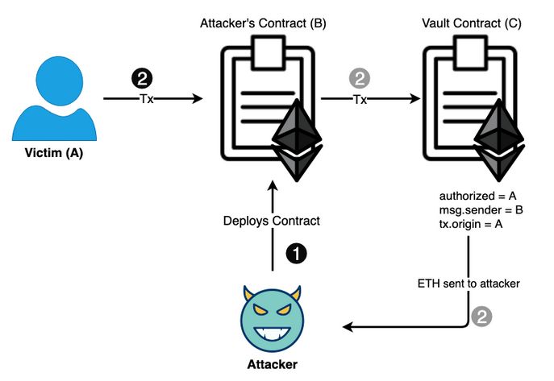

# Avoid using tx.origin for authorization

The msg.sender global variable gives the address of the caller of the function. The tx.origin is also a globally available variable that returns the address of the transaction initiator. For example, using an EOA account; Alice initiates a transaction to Contract-A which further makes a function call to a Contract-B. Then the function present in Contract-B would give the address of the Contract-A when msg.sender is evaluated; however, when tx.origin is evaluated in the same function, it would return the address of Alice's EOA, because Alice is the original transaction initiator.

The tx.origin method should not be used as authorization for any function. The access control protected using tx.origin can be attacked and would allow an attacker to gain unauthorized access rights.

In the following code, we have a Vault contract, which keeps the ether of an owner. The owner of the Vault contract can withdraw their ether at any point in time:

```
contract Vault {
    address authorized;

    modifier onlyAuthorized() {
        // Bad Practice
        require(authorized == tx.origin);
        _;
    }

    function withdraw(address beneficiary) public onlyAuthorized {
        beneficiary.transfer(address(this).balance);
    }
}
```

An attacker writes the AttackerContract code as follows:

```
contract AttackerContract {
  address targetContract;
  address attackerWallet;

  function () external payable {
    Vault(targetContract).withdraw(attackerWallet);
  }
}
```

Here is the diagram explaining how an attacker could attack his victim:


Attacker steals ETH from Victim's contract via tx.origin

In the preceding diagram, we have shown how an attacker attacked on the Vault contract which is using tx.origin in the onlyAuthorized modifier, in order to check the authorization of the function caller. The following actions take place in this scenario:

1. An attacker will create an AttackerContract contract and deploy it. Somehow, an attacker would ask the original owner of the Vault contract to send some ether to the AttackerContract contract.
2. Once the original owner sends the ether to AttackerContract, transaction calls the Vault.withdraw() function. Then, it would check that tx.origin is the authorized person of this contract, execute the withdraw() in the Vault contract, and send all the ether present in the Vault contract to the attacker's wallet.

We have discussed an attack in which there was a Victim (user) and two contracts involved. However, this is not the only case where this kind of attack is possible. There could be many more contracts in between as well. Also, you need to know that when you are using an external library contract, all the function calls are made using delegate calls to the library functions.

## Preventing an attack

You should not use tx.origin in your contract to check for the authorization. Always use msg.sender to check the authorization of the function calls:

```
modifier onlyAuthorized() {
    //Good Practice
    require(authorized == msg.sender);
    _;
}
```

In the preceding code, we are using msg.sender instead of tx.origin. This fixes the issue, and an attacker would not be able to perform the attack because msg.sender always returns the address of the previous caller in the call stack. In the previous attack scenario, msg.sender would return the address of AttackerContract; hence, authorization fails, and funds would not be sent to the attacker.
